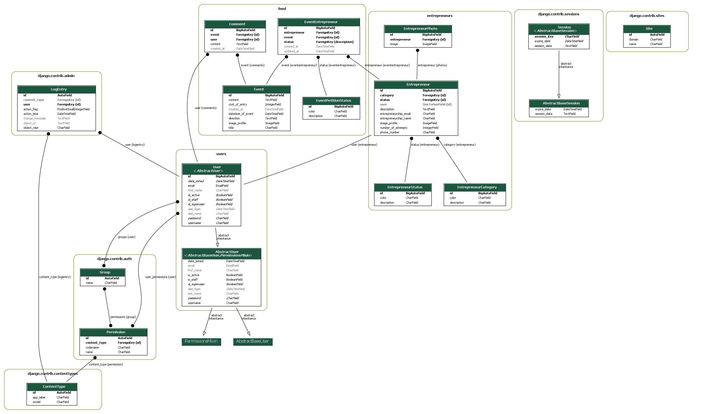

<p align="center">
  <a href="https://rafaela-emprende.herokuapp.com/" target="blank">
  
  </a>
</p>

## Repositorio para el desarrollo del Trabajo Práctico de la materia Ingeniería Web.
### Integrantes del equipo:
##### * Paula Cassina
##### * Mauro Cominotti
##### * Florencia Giay
##### * Gonzalo Knoll

<br />
<br />

Éste es un Trabajo basado en la materia de Ingeniería Web de la UCSE. Link a la wiki de la materia: https://github.com/ucseiw-team/catedra/wiki

## Steps to clone this repository with Conda
El modelo de datos de ésta App es el siguiente:
<p align="center">
  
</p>

<br />
<br />

## Steps to clone this repository with Conda
1. Clone this Django application with the optional step of creating a virtual environment.
```console
$ git clone https://github.com/FlorenciaGiay/TP_IW_Cassina_Cominotti_Giay_Knoll.git

$ cd TP_IW_Cassina_Cominotti_Giay_Knoll

$ conda create -n rafaela_emprende python=3.8

$ source activate rafaela_emprende
```

2. Install your requirements:
```console
$ pip install -r requirements.txt
```

3. Make your migrations:
```console
$ python manage.py makemigrations

$ python manage.py migrate
```

Should print:
```console
$ python manage.py makemigrations
No changes detected

$ python manage.py migrate
Operations to perform:
  Apply all migrations: admin, auth, contenttypes, sessions
Running migrations:
  Applying contenttypes.0001_initial... OK
  Applying auth.0001_initial... OK
  Applying admin.0001_initial... OK
  Applying admin.0002_logentry_remove_auto_add... OK
  Applying admin.0003_logentry_add_action_flag_choices... OK
  Applying contenttypes.0002_remove_content_type_name... OK
  Applying auth.0002_alter_permission_name_max_length... OK
  Applying auth.0003_alter_user_email_max_length... OK
  Applying auth.0004_alter_user_username_opts... OK
  Applying auth.0005_alter_user_last_login_null... OK
  Applying auth.0006_require_contenttypes_0002... OK
  Applying auth.0007_alter_validators_add_error_messages... OK
  Applying auth.0008_alter_user_username_max_length... OK
  Applying auth.0009_alter_user_last_name_max_length... OK
  Applying auth.0010_alter_group_name_max_length... OK
  Applying auth.0011_update_proxy_permissions... OK
  Applying auth.0012_alter_user_first_name_max_length... OK
  Applying sessions.0001_initial... OK
```

4. Create a new superuser
```console
$ python manage.py createsuperuser
```

Then you should see something like this:
```console
Username (leave blank to use 'mauro'): admin
Email address: admin@admin.com
Password: ucse$admin$2022
Password (again): ucse$admin$2022
Superuser created successfully.
```

5. Final checks
```console 
$ python manage.py runserver
```
Then the result should be something like this: 
```console 
$ python manage.py runserver
Watching for file changes with StatReloader
Performing system checks...

System check identified no issues (0 silenced).
August 18, 2022 - 22:59:54
Django version 4.1, using settings 'rafaela_emprende.settings'
Starting development server at http://127.0.0.1:8000/
Quit the server with CTRL-BREAK.
```

Open the browser to the local server IP  http://localhost:8000 or http://127.0.0.1:8000/


<br />
<br />

## Steps to Create a Django App (Condensed)
1. Creating a Django application starts with the optional step of creating a virtual environment.
```console
$ conda create -n <PROJECT_NAME> python=3.8

$ source activate <PROJECT_NAME>
```

2. Install Django: 
```console
$ pip install Django

# or

$ conda install -c anaconda django
```

3. Create a project in Django: 
```console
$ django-admin startproject <PROJECT_NAME>

# Or if you want to create it in the same directory:
# $ django-admin startproject <PROJECT_NAME> .
```

4. Create a Django App: 
```console
$ cd <PROJECT_NAME> 

# then

$ python manage.py startapp <APP_NAME>
```

5. Add app to settings.py: 
```python 
<PROJECT_NAME>/<PROJECT_NAME>/settings.py
```

6. Add URL to the APP in the project: 
```python 
<PROJECT_NAME>/<PROJECT_NAME>/urls.py
```

7. Create the APP urls.py file: 
```console
$ cd django_app then $ touch urls.py
```

8. Add a path to the Index in the URL patterns in 
```python 
<app_name>/urls.py.
```

9. Create the Index Route in 
```python 
<app_name>/views.py
```

10. Create the index.html template: 
```console
$ mkdir -p templates/<APP_NAME> 
```
```console
$ touch templates/<APP_NAME>/index.html
```
then add the HTML to the file.

11. Make the migrations: 
```console
$ cd .. 

# then

$ python manage.py migrate
```

12. Run the Django server: 
```console
$ python manage.py runserver 
```
Then open the browser to the local server IP (generally http://localhost:8000).
